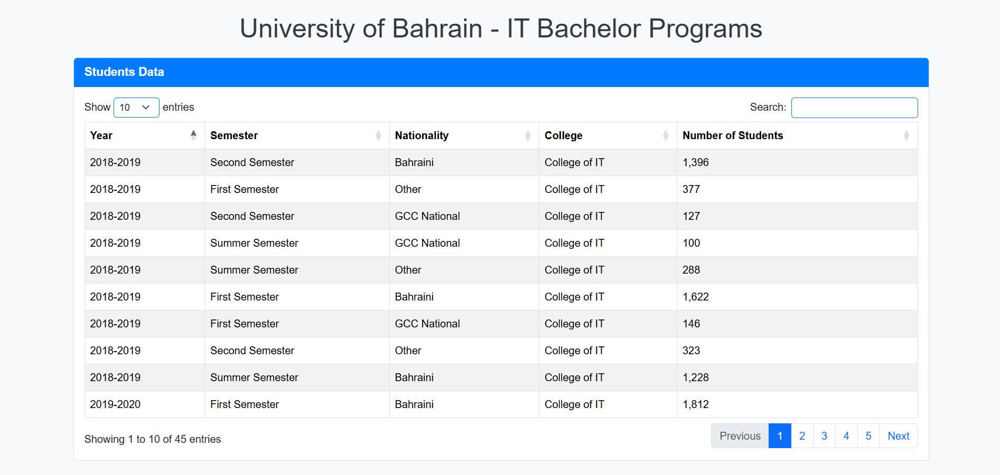
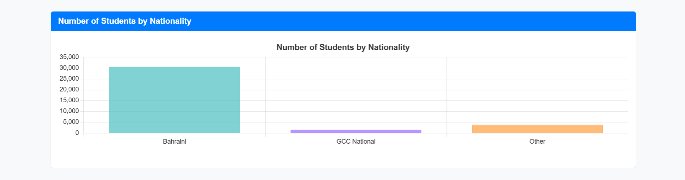

# [University of Bahrain - IT Bachelor Programs](https://7ax.github.io/ITCS333_A3/)

This project retrieves and visualizes data on student enrollments in IT bachelor programs at the University of Bahrain. The data is fetched from the [Bahrain Open Data Portal](https://data.gov.bh/explore/dataset/01-statistics-of-students-nationalities_updated), processed, and displayed in a table and bar chart for easy analysis.

## Live Preview

You can view the live version of the project here:  
**[Live Preview](https://7ax.github.io/ITCS333_A3/)**

## Features

- Fetches data dynamically from the Bahrain Open Data API.
- Displays student enrollment data in an interactive table with filtering, sorting, and pagination.
- Visualizes the number of students by nationality using a responsive bar chart.
- Fully responsive design implemented with **Bootstrap 5** and **DataTables**.
- Custom styling for a professional look and feel.

## Technologies Used

- **HTML5** and **CSS3**
- **JavaScript** (ES6+)
- **Bootstrap 5** for responsive design
- **DataTables** for table interactivity
- **Chart.js** for bar chart visualization
- **Bahrain Open Data API** as the data source

## Screenshots

### Table View
Displays the retrieved data in a searchable, paginated, and sortable table.



### Bar Chart
Shows the number of students by nationality using a dynamic bar chart.



## Setup Instructions

1. Clone the repository:
   ```bash
   git clone https://github.com/7ax/ITCS333_A3.git

2. Open the project folder:
   ```bash
   cd ITCS333_A3
3. Open `index.html` in your preferred browser.


# Project Structure
- `index.html`: Main HTML file with the structure of the application.
- `script.js`: JavaScript file for API fetching, table rendering, and chart creation.
- `images/`: Contains screenshots of the table and chart.
- `README.md`: Documentation for the project.

## Example API Response

Below is a simplified version of the JSON response:

```json
{
  "records": [
    {
      "fields": {
        "year": "2022-2023",
        "semester": "First Semester",
        "nationality": "Bahraini",
        "colleges": "College of IT",
        "number_of_students": 2941
      }
    },
    {
      "fields": {
        "year": "2022-2023",
        "semester": "First Semester",
        "nationality": "GCC National",
        "colleges": "College of IT",
        "number_of_students": 119
      }
    }
  ]
}
